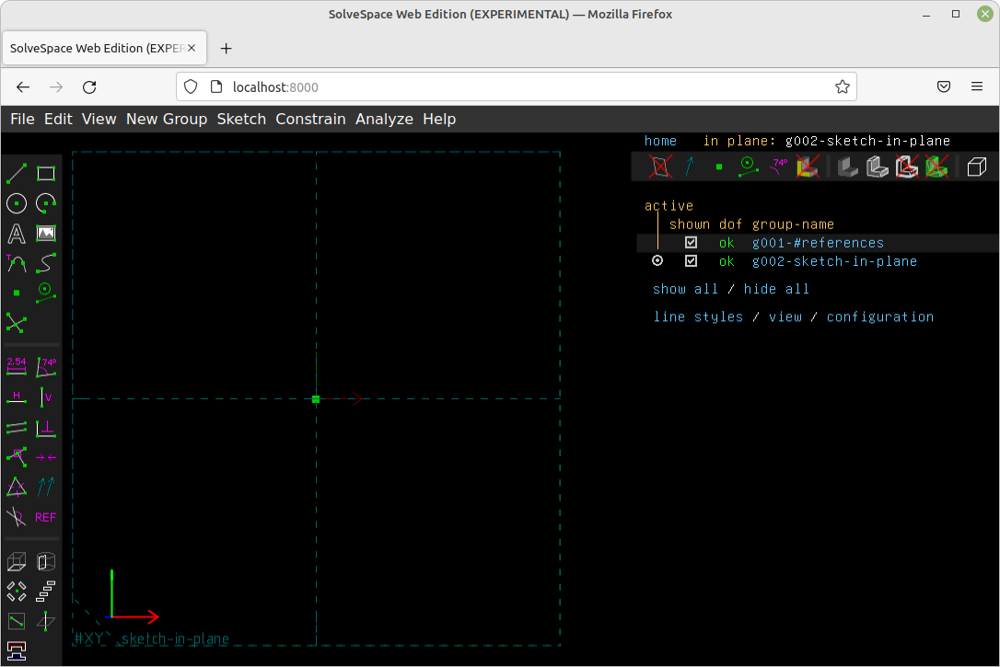

# SolveSpace in a web browser


## Background
### SolveSpace
[SolveSpace](https://solvespace.com/index.pl) is an [open source](https://github.com/solvespace/solvespace),
parametric 2d/3d CAD program.

Major features include:
* constraint based sketcher
* variety of solid modelling methods
* parametric and associative assembly
* various analyses of sketch and solid model
* export to various raster, 2D and 3D formats

It is written in C++ and runs on multiple platforms which support _OpenGl_ eg, Windows, OSX and Linux.

### Web Edition
In mid-2018, an [Experimental SolveSpace Web Edition](https://solvespace.com/forum.pl?action=viewthread&parent=2369)
was released [here](https://files.whitequark.org/SolveSpace/solvespace.html).

This repository is an archive of files at the the above location.

## Prerequisites
* browser which supports web assembly (Chrome + Firefox)
* python3

## Getting started
```bash
git clone https://github.com/TrevorDArcyEvans/solve-space-web.git
cd solve-space-web
./servewasm.py
```
open [SolveSpace Web Edition](http://localhost:8000/)

## Building _SolveSpace Web Edition_
Based on instructions [here](https://github.com/solvespace/solvespace/tree/emscripten#building-for-web)

<details>

### Install prerequisites
```bash
sudo apt install git build-essential cmake
```

### Install emscripten
* [emscripten](https://emscripten.org/docs/getting_started/downloads.html)

### Open emscripten window
```bash
# Get the emsdk repo
git clone https://github.com/emscripten-core/emsdk.git

# Enter emscripten directory
cd emsdk

# Fetch the latest version of the emsdk (not needed the first time you clone)
git pull

# Download and install the latest SDK tools.
./emsdk install latest

# Make the "latest" SDK "active" for the current user. (writes .emscripten file)
./emsdk activate latest

# Activate PATH and other environment variables in the current terminal
source ./emsdk_env.sh
```

### Build
In an _emscripten_ window, from above step:

```bash
git clone https://github.com/solvespace/solvespace
cd solvespace

# 'Web Edition' code is on a branch
git checkout emscripten

git submodule update --init
mkdir build
cd build
emcmake cmake .. -DCMAKE_BUILD_TYPE=Debug
make
```

</details>

## Issues
* still experimental
* file open/save/export/import causes a crash

## Further work
* how to build from source
* fix/avoid crashes
* implement open/save/export/import

